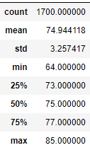
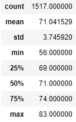
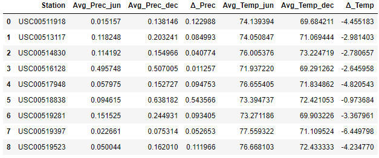

# Surfs Up
## Overview
This report is designed to analyze temperature trends for beachs in Oahu.  The database of information is stored in an SQLite database, [hawaii.sqlite](hawaii.sqlite), and extracted using SQLAlchemy.
## Tables
June Temp. | December Temp.
---------- | -------------
 | 
## Results
The main results are two statistics tables on data from June and December.  Here are a few observations from those tables:
- The *average* temperatures for June and December were **74.9&deg;F** and **71.0&deg;F**, respectively.  These are fairly close numbers, showing that overall, the temperature can be expected to be relatively nice and consistent, which makes sense for a location relatively near the equator.
- The *standard deviation* of June and December were **3.26&deg;F** and **3.75&deg;F***, respectively.  These are also close, but do show a slight more variation in temperatures for December.  This can be confirmed by looking at the *interquartile range* - June's IQR only ranges from **73-77&deg;F**, while December's IQR ranges from **69-74&deg;F** -- not only a lower range, but wider by a degree.
- The minimum values for June and December tell what is likely the largest difference between the two months - though the averages are relatively close, the minimum for June is only **64&deg;F**, while December dipped down to **56&deg;F** at one point.  The maximum values of **85&deg;F** and **83&deg;F** are actually fairly close.  June doesn't get much hotter than December, but a December day has more potential to be cold.
## Summary
Overall, from the analysis above, Oahu is, like much of Hawaii, fairly stable when it comes to temperatures.  There is a slightly lower average in December, as well as the possiblity of a singular significantly cold day, but overall, both months are similar in overall temperatures.
### Additional Queries - Stations
So far, this report only looked at summary statistics on observed temperatures for the whole Oahu dataset.  However, one possible idea would be to group the data by station and see if there are any relevant points about how different stations, and therefore different locales in Oahu, contrast each other.  Here is a couple of sample queries on the average precipitation and temperatures, combined and solved for the differences between June and December, all in one final table: 
```
june_by_station = session.query(Measurement.station, func.avg(Measurement.prcp), func.avg(Measurement.tobs)).\
    filter(extract('month', Measurement.date) == 6).\
    group_by(Measurement.station).all()

dec_by_station = session.query(Measurement.station, func.avg(Measurement.prcp), func.avg(Measurement.tobs)).\
    filter(extract('month', Measurement.date) == 12).\
    group_by(Measurement.station).all()

cols = ['Station','Avg_Prec','Avg_Temp']
june_df = pd.DataFrame(june_by_station, columns=cols)
dec_df = pd.DataFrame(dec_by_station, columns=cols)

june_vs_dec_df = june_df.merge(dec_df, on='Station', suffixes=['_jun','_dec'])

june_vs_dec_df['\u0394_Prec'] = june_vs_dec_df['Avg_Prec_dec'] - june_vs_dec_df['Avg_Prec_jun']
june_vs_dec_df['\u0394_Temp'] = june_vs_dec_df['Avg_Temp_dec'] - june_vs_dec_df['Avg_Temp_jun']

new_cols = ['Station','Avg_Prec_jun','Avg_Prec_dec','\u0394_Prec','Avg_Temp_jun','Avg_Temp_dec','\u0394_Temp']
june_vs_dec_df = june_vs_dec_df[new_cols]
```

#### Interesting Datapoints
- Station USC00516128 has extremely high precipitation for both months, and a slightly lower average temperature as well.
- Station USC00518838 has an extremely large *difference* in precipitation between June and December.  However, it also had the least difference in average temperatures.
- Station USC00519397 has the greatest average temperature difference between June and December, dropping more than 6&deg;F.
